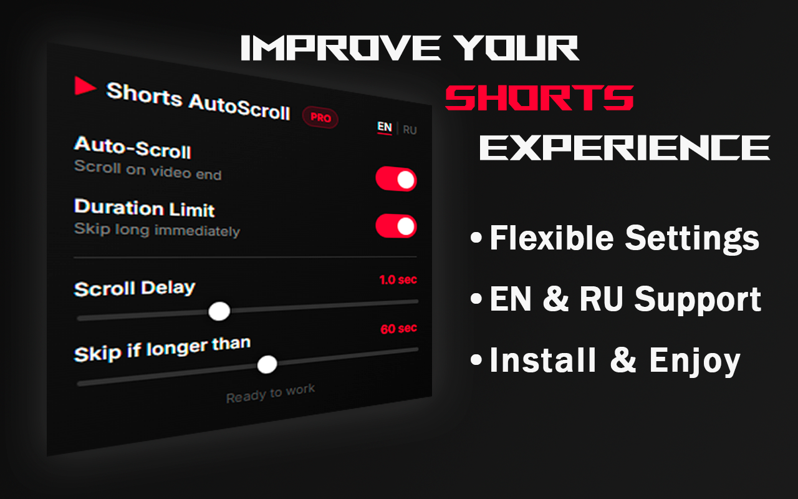

# Youtube Shorts AutoScroll

  
  &nbsp;&nbsp;&nbsp;&nbsp;
  

YouTube Shorts AutoScroll is a completely free browser extension that automatically scrolls through YouTube Shorts videos.

At any time, you can click the extension icon to enable or disable the following features:
– Automatically scroll to the next video when the current one ends
– Automatically skip videos longer than a specified duration
You can also set a delay before scrolling to the next video and choose the maximum video length you want to watch before it gets skipped.

🌏 The extension interface is available in two languages: Russian and English.

Installation instructions:
– Install the extension in your browser
– Refresh the YouTube page

🔒 Privacy Focused. Youtube Shorts AutoScroll works entirely locally on your device. We do not collect, store, or send any user data to external servers.